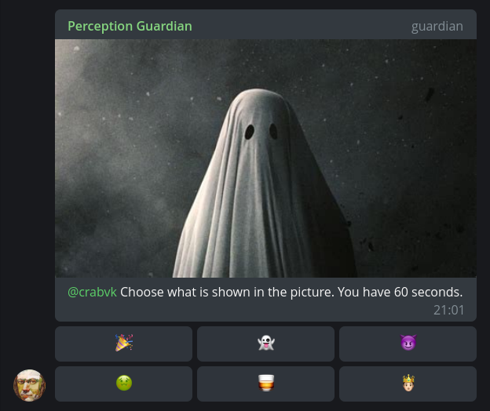

# Perception Guardian

Telegram bot with image/emoji CAPTCHA challenge/response.



## Features

* Show CAPTCHA for new members.
* Ban channels [(optional)](#bot-settings).
* Change bot language per group (only English and Russian supported at the time).
* Custom Welcome Message.

## Configuration

Copy [config.example.yaml](config.example.yaml) to *config.yaml*, see comments for config settings descriptions.  
There're no defaults, all config settings are mandatory.

## Bot settings

Use `/settings` command to change bot settings for a group.

## Webhook setup with Nginx

```nginx
http {
    upstream guardian {
        server WEBHOOK_ADDR fail_timeout=0;
    }

    server {
        # ...

        location /webhook {
            set $token SECRET_TOKEN;

            if ($http_x_telegram_bot_api_secret_token = $token) {
                proxy_pass http://guardian$request_uri;
            }
        }

        location / {
            return 403;
        }
    }
}
```

where `WEBHOOK_ADDR` is the same address:port as in `telegram.webhook_addr` config option,
and `SECRET_TOKEN` is your bot's token with ":" replaced to "_".

## TODO

* Limit number of new chat members per minute, don't show captcha if limit has reached.
* `/vacuum` command to search and delete all "Deleted Account"s in a group.
* Periodicly delete expired `ignore` set key/scores in Redis.
* `/stats` command to show bot statistics: number of users passed/not passed captcha for a group, etc.
* Add more emojis.

## Resources

* [Emoji Meanings Encyclopedia](https://emojis.wiki/)
